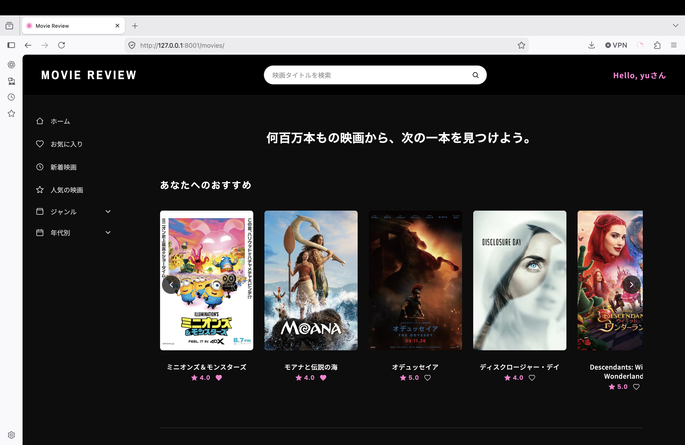

# Movie Review Site



TMDB (The Movie Database) APIと連携した、Django製の映画レビューサイトです。

人気映画や検索結果をリアルタイムに表示し、ユーザーは映画に対して星評価付きレビューを投稿できます。
AI感情分析と協調フィルタリングを活用し、一人ひとりの好みに合わせたおすすめ映画を表示する機能を実装しました。

バックエンドからAI機能まで一貫して開発し、使いやすさを意識して実装しました。

---

## 主な機能

- TMDB APIによる映画情報のリアルタイム取得（人気映画・新着映画・キーワード検索）
- ユーザー登録・ログイン・ログアウト
- 星評価付きレビュー投稿・編集・削除、平均評価表示
- お気に入り機能（映画のお気に入り登録・一覧表示）
- ジャンル別・年代別の映画絞り込み
- AI感情分析（Janome + TF-IDF + ロジスティック回帰）
- 協調フィルタリングを用いた、パーソナライズされたおすすめ映画表示
- Ajaxによるレビュー並び替え
- ページネーション（人気の映画・新着映画・ジャンル別・年代別）
- サイドメニューによるナビゲーション（PC・スマートフォン共通）
- スマートフォン対応（レスポンシブデザイン）

---

## 使用技術

| 分野               | 技術                                  |
|------------------|-------------------------------------|
| Backend          | Python 3.13 / Django 6.0.6          |
| Frontend         | HTML / CSS / JavaScript (Fetch API) |
| Database         | SQLite3                             |
| API              | TMDB API                            |
| Machine Learning | Janome / scikit-learn               |
| Others           | python-dotenv                       |

---

## セットアップ

```bash
git clone https://github.com/yu-studio33/movie_review.git
cd movie_review

python3 -m venv movie_review_env
source movie_review_env/bin/activate

pip install django python-dotenv Pillow requests janome scikit-learn joblib dill

# .envファイルを作成し、SECRET_KEYとTMDB_API_KEYを設定
echo "SECRET_KEY=your-secret-key-here" > .env
echo "DEBUG=True" >> .env
echo "TMDB_API_KEY=your-tmdb-api-key-here" >> .env

python manage.py migrate
python manage.py createsuperuser

# (任意) デモ用のテストユーザー・レビューを投入
python manage.py seed_reviews

python manage.py runserver
```

TMDB APIキーは、TMDB公式サイトで無料で取得できます。

---

## 作者

Yu

GitHub
https://github.com/yu-studio33